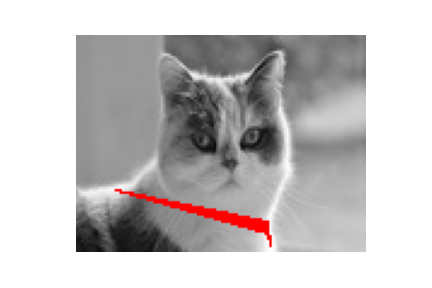
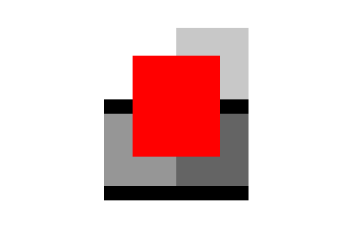
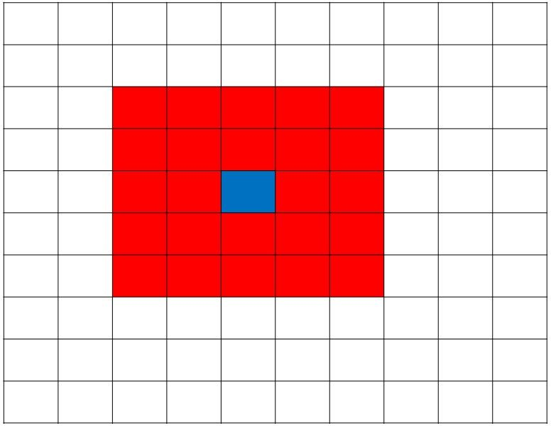

### Non-overapping blocks on a image with maxmimum brightness. The centers of those blocks are later connected to forma quadrilateral, which is shown on the image.

Example cases are:

original
 

patched

original
 

patched

Solution outline: 
The imported **image** is converted into a **grayscale image** and all the possible blocks (patches) of size 5x5 are extracted. Then, the mean values **(average brightness)** for each of the blocks are calculated and kept in a separate 2D array. That array is reshaped into a **vector** and sorted in decreasing order. The indices of the **grayscale image** are found in the order of appearance in the reshaped and sorted **vector**. Then, the first element is extracted from the **vector** and the next element in the **vector** is found (simply by iterating over the elements, since the **vector** is already sorted) with maximum mean that doesn't have an ovelapping block in the **grayscale image**. 

 

*The image for the matrix for the all block means.* 
*Each square is a location for the center of a block in the **grayscale image**.* 
*Imagine a block with a center in the blue square. All the blocks centered in red squares overlap with it in the **grayscale image***. 

Correspondingly, the third and fourth elements are found that do not have ovelapping blocks in the **grayscale image**. The sum of the means of all 4 blocks (this is the **first group of 4 blocks**) is evaluated and kept in a separate variable. Then, we iterate again over the **vector** but begin from the second maximum element in the **vector**. 3 other blocks are found in a similar manner as for the first group of 4 blocks. The sum of the means of the **second group of 4 blocks** is compared with the previous sum and the maximum of these two is kept. In this way, we find 4 non-overlapping blocks (patches) in the **grayscale image** with maximum average brightness. 

Next, the quadrilateral (with corners as centers of the blocks) is drawn in red on the **grayscale image**. For that, the **grayscale image** is converted into a 3D grayscale. Finally, the area is found as the number of red pixels in the **grayscale image**.
